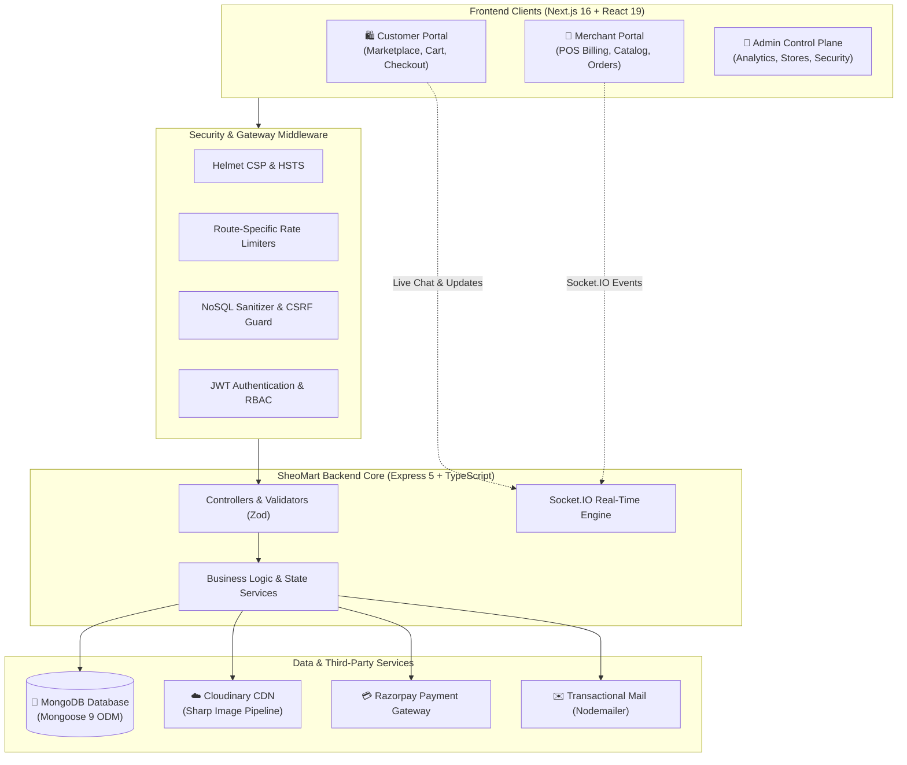

# 🛒 SheoMart — Hyperlocal Multi-Vendor Grocery Marketplace

[](https://nextjs.org/)
[](https://react.dev/)
[](https://www.typescriptlang.org/)
[](https://nodejs.org/)
[](https://expressjs.com/)
[](https://www.mongodb.com/)
[](https://tailwindcss.com/)
[](https://socket.io/)
[](https://cloudinary.com/)
[](https://razorpay.com/)
[](https://opensource.org/licenses/ISC)

**SheoMart** is an enterprise-grade, full-stack multi-vendor hyperlocal quick-commerce marketplace designed to connect local neighbourhood merchants with nearby customers. Engineered with a scalable micro-monorepo structure using **Next.js 16 (App Router)** and **Express 5 (TypeScript)**, SheoMart provides real-time order dispatching, in-store Point-of-Sale (POS) counter billing, automated universal product catalog management, Cloudinary asset pipelines, and multi-tier role-based dashboards.

---

## 📑 Table of Contents

- [Architectural Overview](#-architectural-overview)
- [System Architecture](#-system-architecture)
- [Key Features](#-key-features)
  - [1. Customer Marketplace](#1-customer-marketplace)
  - [2. Merchant & Store Owner Suite](#2-merchant--store-owner-suite)
  - [3. Platform Admin Control Plane](#3-platform-admin-control-plane)
  - [4. Real-Time Infrastructure](#4-real-time-infrastructure)
  - [5. Media & Asset Pipeline](#5-media--asset-pipeline)
  - [6. Security & Infrastructure Hardening](#6-security--infrastructure-hardening)
- [Tech Stack](#-tech-stack)
- [Project Structure](#-project-structure)
- [Getting Started](#-getting-started)
  - [Prerequisites](#prerequisites)
  - [Backend Setup](#backend-setup)
  - [Frontend Setup](#frontend-setup)
  - [Database Seeding](#database-seeding)
- [Environment Variables](#-environment-variables)
- [API Reference](#-api-reference)
- [WebSocket Events](#-websocket-events)
- [Contributing & License](#-contributing--license)

---

## 🌟 Architectural Overview

SheoMart is crafted around the **hyperlocal retail model**:
- **Geofenced Operations:** Customers see verified stores and products delivering directly to their detected or selected pincode and GPS coordinates.
- **Hybrid Commerce:** Supports both online door-to-door delivery with time slots, customer in-store self-pickup, and merchant over-the-counter POS walk-in billing.
- **Universal Catalog Engine:** Eliminates redundant data entry across stores by maintaining an admin-curated universal master catalog with 1-click store cloning and deduplication.
- **Resilient Security Pipeline:** End-to-end defense-in-depth architecture adhering to OWASP recommendations with CSRF protection, strict Content-Type enforcement, NoSQL sanitization, rate limiting, and dual-token JWT rotation.

---

## 📐 System Architecture



---

## ✨ Key Features

### 1. Customer Marketplace
- **Hyperlocal Geocoding & Pincode Detection:** Real-time pincode filter dynamically re-scopes stores, products, and estimated fulfillment times.
- **Dynamic Homepage:**
  - Dynamic hero section with quick category navigation and local branding.
  - **Live Store Showcase & Pincode Filter:** Seamlessly view stores serving your exact area.
  - **Real Customer Reviews & Testimonials:** Displays verified customer feedback with ratings. Includes an interactive **"See all reviews"** modal with search, star filters, and verified badge indicators.
  - **Live Platform Metrics:** Real-time counters showing registered stores, active catalog items, satisfied shoppers, and serviceable pincodes.
  - **SheoMart Story Section:** Community-oriented narrative celebrating local commerce.
- **Cart & Intelligent Checkout:**
  - Multi-item cart with store-level delivery rule validation (minimum order, free delivery thresholds, dynamic platform fee).
  - Multi-address manager with geolocation mapping and tag selection (Home, Work, Other).
  - Delivery time slot selector (Morning, Afternoon, Evening) or Self-Pickup option.
  - Secure payments via **Razorpay** (UPI, Cards, NetBanking, Wallets) and Cash on Delivery (COD).
- **Order Lifecycle & Tracking:** Detailed order status tracking (`Placed` ➔ `Confirmed` ➔ `Preparing` ➔ `Out for Delivery` ➔ `Delivered`).
- **Support Desk & Live Chat:** Built-in customer service ticketing system with live Socket.IO messaging and typing indicators.

---

### 2. Merchant & Store Owner Suite
- **Interactive Merchant Dashboard:** Live charts tracking daily revenue, weekly volume, top-selling SKUs, average order value, and order fulfillment ratios.
- **Point of Sale (POS) & Counter Billing:**
  - Rapid counter sales billing interface designed for barcode scanners and keyboard shortcuts.
  - Instant offline invoice creation with item lookup, custom tax, and discounts.
  - Thermal receipt printing generator (80mm / 58mm POS formats).
  - In-store pickup payment reconciler for online orders collected at the store.
- **Universal Catalog Integration & Product Manager:**
  - Seamless product creation with rich attributes, MRP, selling price, units (kg, g, l, pcs), and stock tracking.
  - **Admin Universal Catalog Cloning:** Browse master catalog items and clone directly into your store inventory with custom price and stock in one click, preventing duplicate entries.
- **Store Branding & Settings:**
  - **Direct Cloudinary Upload:** Upload high-resolution store logo and banner covers directly from your local device to Cloudinary (`sheomart/store_assets`).
  - **Direct Link Support:** Preserves URL input for linking external images.
  - Visual preview cards with instant remove/clear capability.
  - Configure delivery radius (km), base delivery fee, free delivery threshold, and preparation times.
  - Create and toggle customizable hourly delivery windows with capacity caps.
- **Customer CRM & Plus Membership:**
  - Customer directory with lifetime spend, visit count, and order history.
  - Grant VIP / Plus Membership privileges to loyal patrons.

---

### 3. Platform Admin Control Plane
- **Executive Analytics:** High-level platform GMV, commission margins, gross orders, active merchants, and registered users.
- **Merchant Management & Verification:**
  - Review and approve new store vendor applications.
  - Award verified trust badges: `Standard Store`, `Verified Store`, and `Royal Merchant`.
  - Suspend or activate stores in real-time.
- **Universal Master Catalog:**
  - Curate and maintain platform-wide master product templates for quick merchant onboarding.
  - Universal product deduplication engine.
- **Financial & Platform Controls:**
  - Configure global platform convenience fees (flat or percentage-based).
  - Global emergency **Maintenance Mode** switch that gracefully routes public traffic to maintenance notices while preserving admin access.
- **Security & Audit Logs:**
  - Track admin actions, privilege escalations, and seller security requests.
  - Secure seller and admin password reset management.

---

### 4. Real-Time Infrastructure
- **Socket.IO Engine (`sheomart-backend/src/socket.ts`):**
  - Room-based isolation: `join_store` room for instant merchant order dispatching.
  - Support ticket rooms: `join_ticket`, `leave_ticket`, `typing`, `stop_typing` for real-time customer support chat.
  - Auto-reconnect handling with JWT token synchronization.

---

### 5. Media & Asset Pipeline
- **Cloudinary Integration:** Cloud-hosted, high-performance image transformations with organized folder schemas (`sheomart/products`, `sheomart/stores`, `sheomart/categories`).
- **In-Memory Buffer Processing:** Multer memory storage coupled with Sharp image optimization for fast, secure file handling without disk clutter.
- **Magic Byte Validation:** Validates actual binary file headers to block malicious file extension spoofing.

---

### 6. Security & Infrastructure Hardening
- **Dual-Token JWT Authentication:** Short-lived access tokens (15m) paired with long-lived rotating refresh tokens (7d) stored in secure HTTP-only cookies.
- **Header Hardening via Helmet:** Strict Content Security Policy (CSP), HTTP Strict Transport Security (HSTS 1 year with preload), Frameguard, and X-Content-Type-Options.
- **Mozilla Observatory Optimizations:** Dedicated `Permissions-Policy` and `X-Permitted-Cross-Domain-Policies` headers.
- **NoSQL Injection Guard:** Deep recursive query sanitization stripping `$` and `.` operators from request bodies and query parameters.
- **CSRF Protection & Enforced Content-Type:** Strict request validation blocking forged cross-site payloads on mutating routes.
- **Granular Rate Limiters:** Dedicated rate limit thresholds for sensitive endpoints (`/search`, `/billing`, `/analytics`, `/auth`).

---

## 🛠️ Tech Stack

### Frontend
| Technology | Version | Purpose |
| :--- | :--- | :--- |
| **Next.js** | `16.2.9` | App Router, Server Components, Route Handlers |
| **React** | `19.2.4` | Core UI Component Library |
| **TypeScript** | `5.x` | Strict Static Type Safety |
| **Tailwind CSS** | `v4` | High-performance modern utility styling |
| **TanStack React Query**| `5.101.2` | Server-state caching, invalidation & sync |
| **Zustand** | `5.0.14` | Lightweight client state management (Auth, Cart, Geo) |
| **Recharts** | `3.10.1` | Analytics charts & telemetry dashboards |
| **Socket.IO Client** | `4.8.4` | Bi-directional real-time communication |
| **Lucide React** | `1.22.0` | Modern, consistent icon set |
| **React Hook Form + Zod**| `7.80.0` / `4.4.3` | Form management and runtime schema validation |

### Backend
| Technology | Version | Purpose |
| :--- | :--- | :--- |
| **Node.js** | `20+` | Server Runtime Environment |
| **Express.js** | `5.2.1` | REST API Routing Framework |
| **TypeScript** | `6.0.3` | Backend Type Safety & Tooling |
| **MongoDB & Mongoose** | `9.7.3` | NoSQL Database & Schema Modeling |
| **Socket.IO** | `4.8.4` | Real-time WebSocket Gateway |
| **Cloudinary SDK** | `2.10.1` | Cloud asset upload & CDN delivery |
| **Sharp** | `0.35.3` | High-performance image conversion & optimization |
| **Razorpay SDK** | `2.9.6` | Payment orders & cryptographic webhook verification |
| **Nodemailer** | `10.0.8` | Transactional emails & verification workflows |
| **Helmet & HPP** | `8.2.0` / `0.2.3` | Security headers & parameter pollution prevention |
| **express-rate-limit** | `8.5.2` | Endpoint rate limiting & DDoS mitigation |

---

## 📁 Project Structure

```text
SheoMart/
├── sheomart-frontend/                 # Next.js 16 Client Application
│   ├── public/                        # Static assets, branding, icons
│   ├── src/
│   │   ├── app/                       # App Router page routes
│   │   │   ├── (auth)/                # Login, Register, Forgot Password
│   │   │   ├── admin/                 # Platform Admin control panel
│   │   │   │   ├── analytics/         # Platform metrics & GMV
│   │   │   │   ├── products/          # Universal catalog manager
│   │   │   │   ├── stores/            # Store approval & verification
│   │   │   │   ├── security/          # Security audit logs
│   │   │   │   └── settings/          # Global platform fees & maintenance
│   │   │   ├── cart/                  # Shopping cart
│   │   │   ├── checkout/              # Address selection & payment
│   │   │   ├── orders/                # Customer order tracking
│   │   │   ├── store/                 # Merchant portal
│   │   │   │   ├── analytics/         # Merchant performance charts
│   │   │   │   ├── billing/           # POS terminal & receipt printer
│   │   │   │   ├── inventory/         # Stock levels & alerts
│   │   │   │   ├── orders/            # Live order queue
│   │   │   │   ├── products/          # Store catalog & catalog cloning
│   │   │   │   └── settings/          # Cloudinary logo/banner & slots
│   │   │   ├── stores/                # Public store directory
│   │   │   └── support/               # Real-time customer support chat
│   │   ├── components/                # Reusable UI components & layouts
│   │   ├── hooks/                     # Custom React hooks
│   │   ├── lib/                       # Socket client, formatters, utilities
│   │   ├── services/                  # Axios API integration layer
│   │   ├── store/                     # Zustand stores (auth, cart, location)
│   │   └── types/                     # TypeScript shared interfaces
│   └── package.json
│
├── sheomart-backend/                  # Express 5 REST & WebSocket Server
│   ├── src/
│   │   ├── config/                    # Database, Cloudinary, Razorpay, Env
│   │   ├── constants/                 # Roles, status codes, folders
│   │   ├── controllers/               # Route business controllers
│   │   ├── errors/                    # AppError & standard error handlers
│   │   ├── middleware/                # Auth, RBAC, Rate-limit, Sanitize, Upload
│   │   ├── models/                    # Mongoose schemas (User, Store, Product, Order...)
│   │   ├── routes/                    # Express modular route definitions
│   │   ├── scripts/                   # Database seeders (seedAdmin.ts)
│   │   ├── services/                  # Reusable business logic services
│   │   ├── types/                     # Backend TypeScript typings
│   │   ├── utils/                     # Password hashing, tokens, API response
│   │   ├── validators/                # Zod request payload schemas
│   │   ├── app.ts                     # Express application configuration
│   │   ├── server.ts                  # Server entrypoint & HTTP listener
│   │   └── socket.ts                  # Socket.IO event handler initialization
│   └── package.json
│
└── README.md                          # Project documentation
```

---

## 🚀 Getting Started

### Prerequisites

Ensure you have the following installed on your local machine:
- **Node.js:** `v20.0.0` or higher
- **npm:** `v10.0.0` or higher
- **MongoDB:** A running local instance or a [MongoDB Atlas](https://www.mongodb.com/atlas) connection string
- **Cloudinary Account:** For image asset management
- **Razorpay Account (Test Mode):** For payment processing

---

### Backend Setup

1. **Navigate to the backend directory:**
   ```bash
   cd sheomart-backend
   ```

2. **Install dependencies:**
   ```bash
   npm install
   ```

3. **Configure environment variables:**
   Copy the example environment file and fill in your credentials:
   ```bash
   cp .env.example .env
   ```

4. **Seed the initial Platform Admin user:**
   Make sure `MONGODB_URI` and `SEED_ADMIN_*` variables are configured in `.env`, then run:
   ```bash
   npm run seed
   ```

5. **Start the backend development server:**
   ```bash
   npm run dev
   ```
   The backend API will run at `http://localhost:5000`.

---

### Frontend Setup

1. **Navigate to the frontend directory:**
   ```bash
   cd ../sheomart-frontend
   ```

2. **Install dependencies:**
   ```bash
   npm install
   ```

3. **Configure environment variables:**
   Copy the example environment file:
   ```bash
   cp .env.example .env.local
   ```

4. **Start the Next.js development server:**
   ```bash
   npm run dev
   ```
   Open [http://localhost:3000](http://localhost:3000) in your browser.

---

## 🔐 Environment Variables

### Backend (`sheomart-backend/.env`)

| Variable | Description | Example |
| :--- | :--- | :--- |
| `PORT` | Backend server port | `5000` |
| `NODE_ENV` | Application environment | `development` / `production` |
| `MONGODB_URI` | MongoDB connection connection string | `mongodb://localhost:27017/sheomart` |
| `JWT_ACCESS_SECRET` | Secret for short-lived access tokens | `your_access_jwt_secret` |
| `JWT_REFRESH_SECRET` | Secret for rotating refresh tokens | `your_refresh_jwt_secret` |
| `JWT_ACCESS_EXPIRES_IN` | Access token lifespan | `15m` |
| `JWT_REFRESH_EXPIRES_IN`| Refresh token lifespan | `7d` |
| `CORS_ORIGIN` | Allowed client origin for CORS | `http://localhost:3000` |
| `FRONTEND_URL` | Frontend client application URL | `http://localhost:3000` |
| `CLOUDINARY_CLOUD_NAME` | Cloudinary cloud account name | `your_cloudinary_name` |
| `CLOUDINARY_API_KEY` | Cloudinary API Key | `your_cloudinary_key` |
| `CLOUDINARY_API_SECRET` | Cloudinary API Secret | `your_cloudinary_secret` |
| `RAZORPAY_KEY_ID` | Razorpay Key ID | `rzp_test_...` |
| `RAZORPAY_KEY_SECRET` | Razorpay Key Secret | `your_razorpay_secret` |
| `SMTP_HOST` | Mail server host | `smtp.gmail.com` |
| `SMTP_PORT` | Mail server port | `587` |
| `SMTP_USER` | Mail server username | `your-email@gmail.com` |
| `SMTP_PASSWORD` | Mail server app password | `your_app_password` |
| `SMTP_FROM` | Outgoing email address sender header | `"SheoMart" <no-reply@sheomart.com>` |
| `SEED_ADMIN_NAME` | Initial administrator name for seeding | `Platform Admin` |
| `SEED_ADMIN_EMAIL` | Initial administrator email for seeding | `admin@sheomart.com` |
| `SEED_ADMIN_MOBILE` | Initial administrator phone for seeding | `9876543210` |
| `SEED_ADMIN_PASSWORD` | Initial administrator password for seeding | `Admin@12345` |

### Frontend (`sheomart-frontend/.env.local`)

| Variable | Description | Example |
| :--- | :--- | :--- |
| `NEXT_PUBLIC_API_URL` | Base URL of SheoMart Express backend | `http://localhost:5000` |
| `NEXT_PUBLIC_RAZORPAY_KEY_ID` | Public Razorpay Key ID for client checkout | `rzp_test_...` |

---

## 📡 API Reference

All REST endpoints are prefixed with `/api/v1` (with public health checks available at `/` and `/health`).

### Authentication & Identity
- `POST /api/v1/auth/register` — Register a customer account
- `POST /api/v1/auth/login` — Login with credentials (receives access & refresh tokens)
- `POST /api/v1/auth/refresh` — Rotate and obtain fresh access token
- `POST /api/v1/auth/logout` — Invalidate session and clear auth cookies
- `GET /api/v1/auth/me` — Fetch currently authenticated user profile

### Stores & Merchant Management
- `GET /api/v1/stores` — Query stores with optional pincode, city, and state filters
- `GET /api/v1/stores/:storeId` — Retrieve single store details
- `POST /api/v1/stores` — Submit vendor / store application
- `GET /api/v1/stores/me` — Retrieve logged-in merchant's store details
- `PATCH /api/v1/stores/me` — Update store metadata, delivery fees, radius, slots
- `POST /api/v1/stores/me/upload-asset` — Upload store logo or banner cover to Cloudinary
- `GET /api/v1/stores/admin` — Fetch all stores (Platform Admin)
- `PATCH /api/v1/stores/:storeId/status` — Approve, suspend, or activate a store
- `PATCH /api/v1/stores/:storeId/badge` — Update verification badge (`normal`, `verified`, `royal`)

### Products & Universal Catalog
- `GET /api/v1/products` — Browse products with search, category, and store filters
- `GET /api/v1/products/:productId` — Get full product details
- `POST /api/v1/products` — Create a new product (with optional image upload)
- `PATCH /api/v1/products/:productId` — Update product details, pricing, and stock
- `DELETE /api/v1/products/:productId` — Remove product from store
- `POST /api/v1/products/admin/clone-to-store` — Clone products from Admin Master Catalog to a store

### Point of Sale (POS) & In-Store Billing
- `POST /api/v1/billing/invoices` — Create offline walk-in POS invoice
- `GET /api/v1/billing/invoices` — List store billing invoices
- `GET /api/v1/billing/invoices/:invoiceId` — Retrieve single invoice details
- `POST /api/v1/billing/invoices/:invoiceId/confirm-payment` — Confirm offline payment
- `POST /api/v1/billing/pickup/:orderId/complete` — Reconcile & mark store pickup order as paid
- `GET /api/v1/billing/customers` — Get store customer directory & loyalty stats

### Cart, Orders & Payments
- `GET /api/v1/cart` — Retrieve customer cart
- `POST /api/v1/cart` — Add or modify cart items
- `DELETE /api/v1/cart/:itemId` — Remove item from cart
- `POST /api/v1/orders` — Create new order
- `GET /api/v1/orders` — List user's orders
- `GET /api/v1/orders/:orderId` — View order details & status
- `PATCH /api/v1/orders/:orderId/status` — Merchant order status transition
- `POST /api/v1/payments/razorpay/create-order` — Initialize Razorpay checkout order
- `POST /api/v1/payments/razorpay/verify` — Verify Razorpay payment signature

### Reviews & Homepage
- `GET /api/v1/products/:productId/reviews` — Fetch reviews for a specific product
- `POST /api/v1/products/:productId/reviews` — Submit verified customer review
- `GET /api/v1/home/reviews` — Fetch high-rating verified reviews for landing page
- `GET /api/v1/home/stats` — Fetch real-time aggregate marketplace stats

---

## ⚡ WebSocket Events

SheoMart uses **Socket.IO** for low-latency live operations:

| Event Name | Direction | Payload | Description |
| :--- | :--- | :--- | :--- |
| `join_store` | Client ➔ Server | `storeId: string` | Merchant joins store room for live order events |
| `leave_store` | Client ➔ Server | `storeId: string` | Merchant leaves store room |
| `join_ticket` | Client ➔ Server | `ticketId: string` | Join support ticket room for live messaging |
| `leave_ticket`| Client ➔ Server | `ticketId: string` | Leave support ticket room |
| `typing` | Client ➔ Server | `{ ticketId, userName }` | Broadcast typing indicator to ticket room |
| `stop_typing` | Client ➔ Server | `{ ticketId }` | Broadcast stop typing indicator |

---

## 📜 Available Scripts

### Backend (`sheomart-backend`)
```bash
npm run dev           # Start development server with ts-node-dev hot reload
npm run build         # Compile TypeScript code to dist/
npm run start         # Run compiled production server from dist/server.js
npm run seed          # Seed default platform admin account
npm run lint          # Run ESLint validation
npm run format        # Run Prettier code formatting
```

### Frontend (`sheomart-frontend`)
```bash
npm run dev           # Start Next.js development server
npm run build         # Build production-optimized Next.js bundle
npm run start         # Run production Next.js server
npm run lint          # Run Next.js ESLint checks
```

---

## 🤝 Contributing & License

Contributions, feedback, and pull requests are warmly welcomed! If you encounter any bugs or have feature proposals, please submit an issue.

Distributed under the **ISC License**. See `LICENSE` for more information.

---

<p align="center">
  Built with ❤️ for local commerce and modern hyperlocal retail ecosystems.
</p>